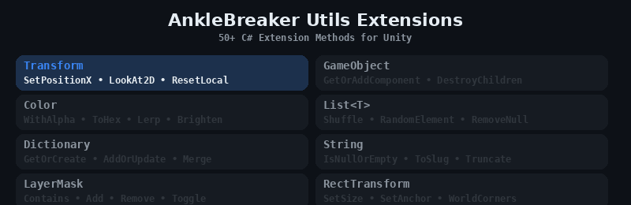

<p align="center">
  
</p>

# AnkleBreaker Utils Extensions — 50+ C# Extension Methods for Unity

> **Extension methods for built-in Unity and C# types, helpers, and utility structs.** Transform, GameObject, Color, List, Dictionary, String, RectTransform, LayerMask, and more. UPM-ready, zero dependencies. Free and open source by [AnkleBreaker Studio](https://github.com/AnkleBreaker-Studio).

[](https://github.com/sponsors/AnkleBreaker-Studio)
[](https://assetstore.unity.com/publishers/101837)

## Installation

Add via Unity Package Manager using the Git URL:

```
https://github.com/AnkleBreaker-Studio/AnkleBreaker-Utils-Extensions.git
```

## Contents

### Extension Methods — Built-in Types

AnimationCurve, Collider, Color, Color32, ContentSizeFitter, DateTime, Debug, Dictionary, Enumerable, EventSystem, Float, GameObject, Int, LayerMask, List, Object, Quaternion, Queue, RectTransform, SkinnedMeshRenderer, String, Texture2D, Transform, UInt

### Extension Methods — AB Types

PositionRotation extensions (transform-equivalent operations without a Transform component)

### Helpers

- `FlagsHelper` — generic bitwise flag operations (IsSet, Set, Unset, Toggle, etc.)

### Random

- `AB_Random` — extended random utilities (Range with exclusion, weighted random, shuffling)

### Type Definitions

- `PositionRotation` — serializable struct for position + rotation pairs

## Part of the AnkleBreaker Ecosystem

| Package | Description |
|---------|-------------|
| [AnkleBreaker-Core](https://github.com/AnkleBreaker-Studio/AnkleBreaker-Core) | Base classes, interfaces, delegates |
| [Utils-Inspector](https://github.com/AnkleBreaker-Studio/AnkleBreaker-Utils-Inspector) | 40+ custom inspector attributes (free Odin alternative) |
| **Utils-Extensions** (this) | 50+ C# extension methods for Unity |
| [Utils-UniversalTypes](https://github.com/AnkleBreaker-Studio/AnkleBreaker-Utils-UniversalTypes) | Universal wrappers for localization, assets, audio |
| [Unity MCP](https://github.com/AnkleBreaker-Studio/unity-mcp-server) | 268 AI tools for Unity Editor control |

## Requirements

- Unity 2022.3 LTS or later

## License

See [LICENSE.md](LICENSE.md)
